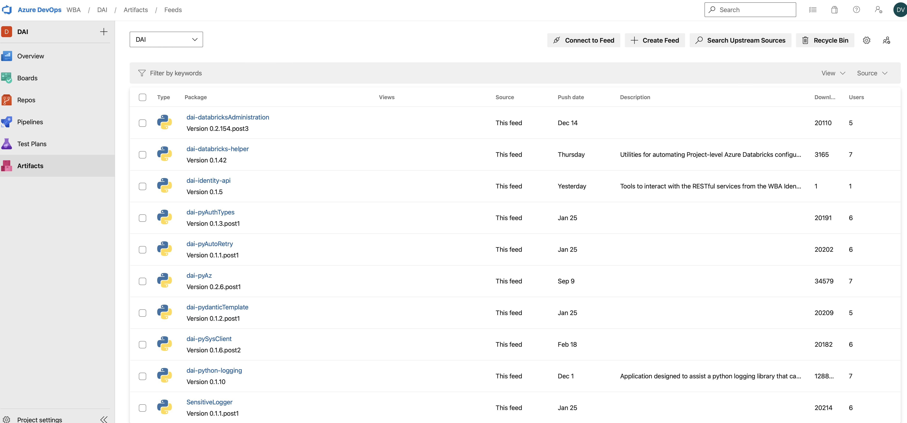
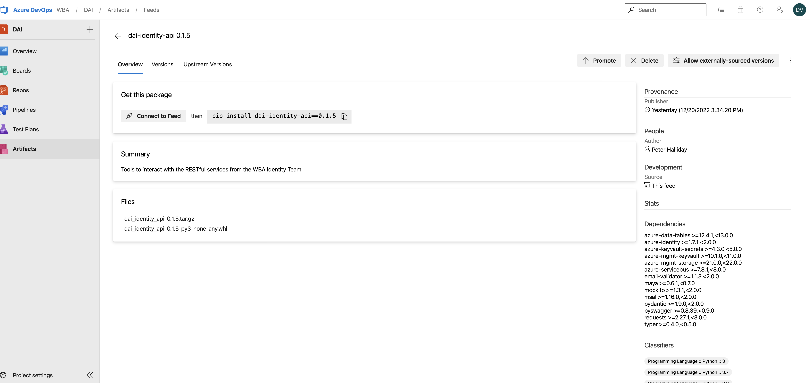
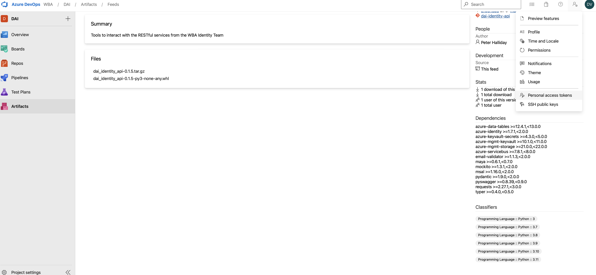
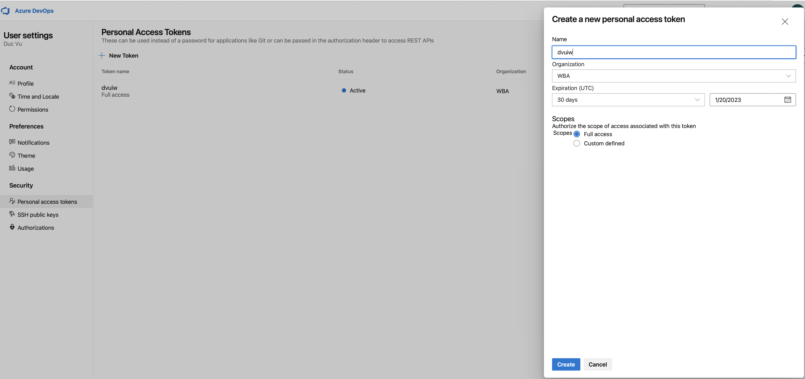
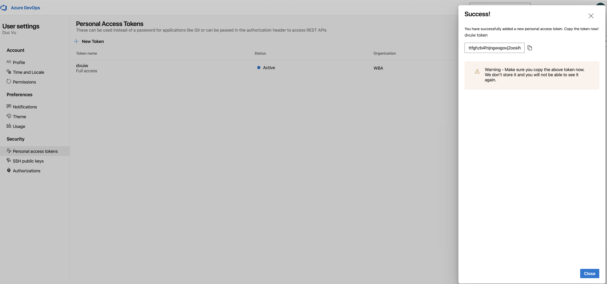
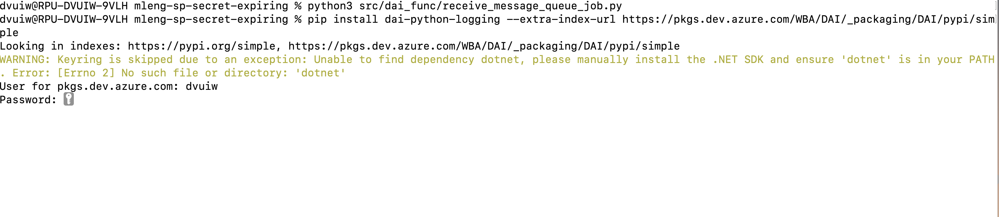

#   Install a package from our Azure DevOps Artifacts feed 

Package from our Azure DevOps Artifacts is internal package, we can not download directly. 

For example,  we want to install `dai-identity-api` package

`pip install dai-identity-api` will not work. We will need to pass extra index url

##  Here are steps to install a Python package

- Step 1 : Create username and password  to access REST APIs
  - Go to Personal Access Tokens

  - Create a new personal access token

  - Token is created, make sure to save this token somewhere (like .txt file) for later use
  

- Step 2 : Pass extra index url to install a Python package from Azure DevOps Artifacts

  - `pip install <python-package>   --extra-index-url https://pkgs.dev.azure.com/<your-organization-name>/<your-project-name>/_packaging/<your-feed-name>/pypi/simple`

  - In this case : 
    - `pip install dai-identity-api --extra-index-url https://pkgs.dev.azure.com/WBA/DAI/_packaging/DAI/pypi/simple`

- Step 3 : Provide any username and  password (token)

