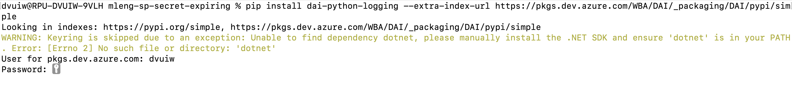

#   Install a package from our Azure DevOps Artifacts feed 

Package from our Azure DevOps Artifacts is internal package, we can not download directly. 

If we want to install `dai-identity-api` package

`pip install dai-identity-api` will not work. We will need to pass extra index url

- Step 1 : Create 

- Step 2 : 
`pip install <python-package>   --extra-index-url https://pkgs.dev.azure.com/<your-organization-name>/<your-project-name>/_packaging/<your-feed-name>/pypi/simple

in this case : `pip install dai-python-logging --extra-index-url https://pkgs.dev.azure.com/WBA/DAI/_packaging/DAI/pypi/simple`

- Step 3 :
